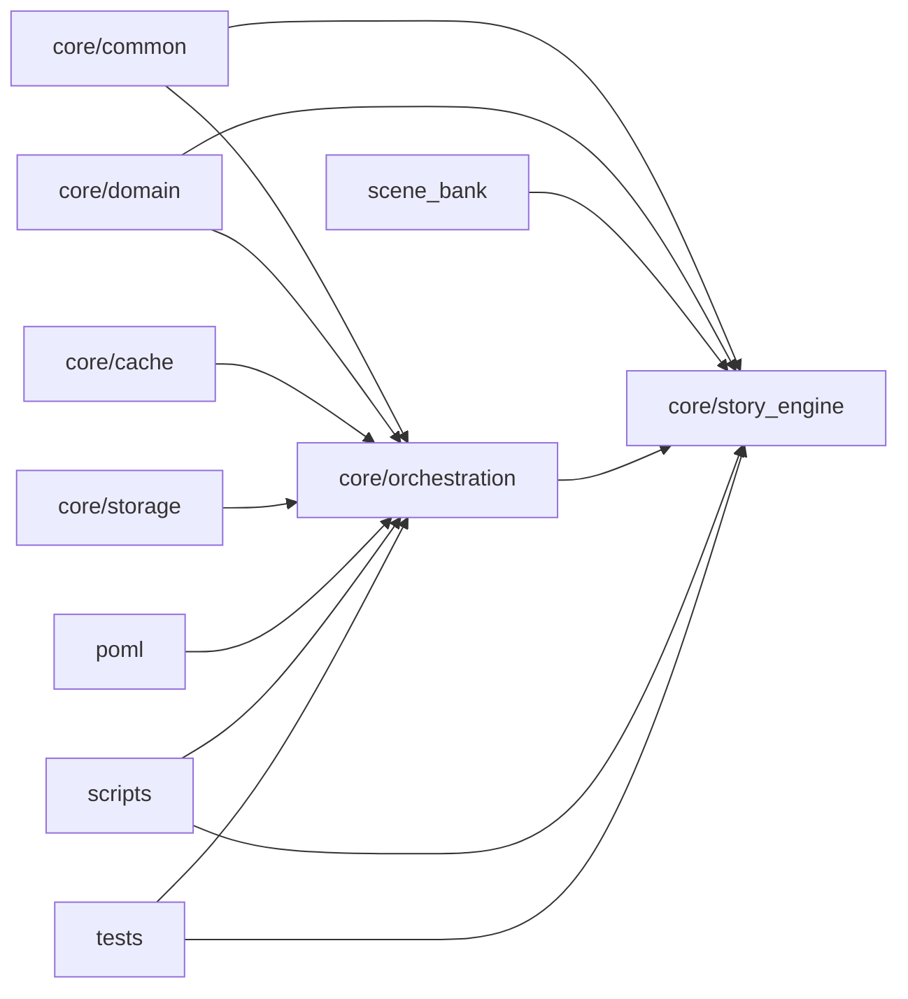

# Repo Map (Lite)

Purpose: Narrative/story generation and simulation engine with orchestrated LLM pipelines, persona agents, and scene bank integration.

- Primary languages: Python
- Package managers: None detected (no pyproject.toml/requirements.txt present at root scan)

## Detected Modules / Packages
- core/cache (response_cache.py) — caching layer for LLM responses/results
- core/character_engine — character and multi-agent simulation pipelines
- core/common — shared utilities: config, dotenv loading, logging, CLI helpers, result store
- core/domain — domain models for story/characters/scenes
- core/orchestration — LLM orchestration layer, loaders, unified interfaces, agent controllers
- core/storage — storage adapters (e.g., database connections)
- core/story_engine — narrative graph, pipelines, world state and story arc engines
- poml — prompt object markup language: components, templates, integration and docs
- scene_bank — prebuilt scenes JSON
- scripts — CLI utilities and runners (evaluation, wallet setup, simulations)
- tests — pytest suite covering orchestration, pipelines, storage, integr. tests
- examples — small usage examples/demos

## Dependency Sketch (coarse)

## Key Observations
- Entry points: multiple Python scripts in `scripts/` (e.g., run_meta_pipeline.py, simulate_from_scene_bank.py) and tests invoking orchestrators.
- Architecture: layered core with `common`, `domain`, `orchestration`, and `story_engine`; POML drives templated prompting and integration.
- Testing: substantial pytest coverage across orchestration, pipeline smoke, database, and POML adapters (`pytest.ini` present).
- Config: `.env*` files and `core/common/config.py` suggest environment-driven configuration; `config.yaml` at root; Docker Compose present.
- Caching/Storage: `core/cache/response_cache.py` and `core/storage/database.py` indicate pluggable persistence; Oracle wallet setup scripts exist.
- LLM Integration: `core/orchestration/*` includes unified/standardized LLM interfaces and autonomous persona agents.
- Data assets: `scene_bank/*.json` and `poml/templates/**` provide reusable content and prompt structures.
- Examples: `examples/**` shows usage patterns for autonomous agent and standardized LLM migration.
